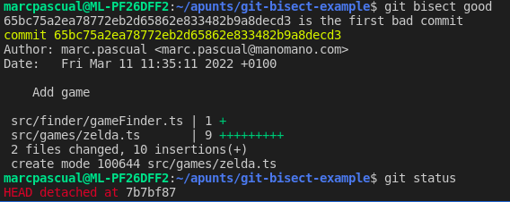

# Bisect example

## Guide
Have you ever noticed a bug but you don't understand **when** and **how** it was created?
Stop being beating your brain up and use `git bisect`:
```sh
git bisect start
git bisect bad # current commit is bad
git bisect good 3eac5bd # this hash is the last known good commit
```
Git bisect will detach your repo for a different commit everytime. You only have to tell if it's a `good` or a `bad` one. Finally it will tell you which was the origin commit of the bug!


Try to find out at which commit this project started malfunctioning!
<details>
  <summary>See the solution (<bold>SPOILER</bold>)</summary>
  
  
  
</details>